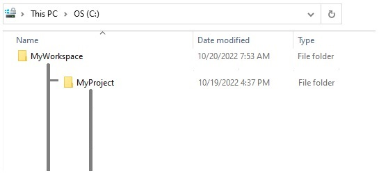
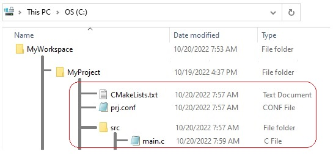
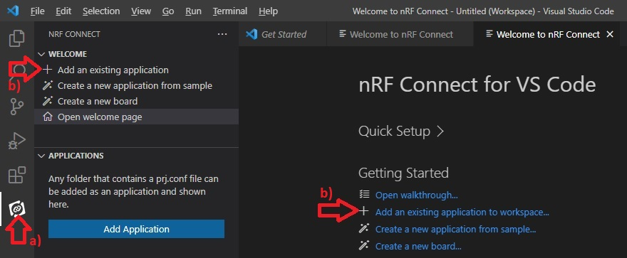
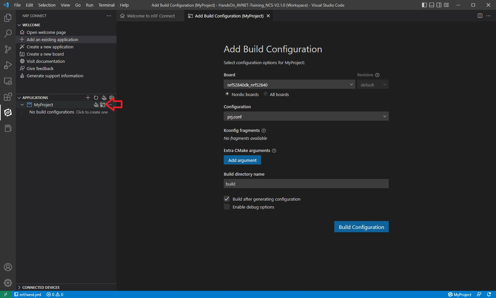
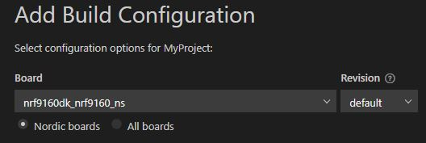
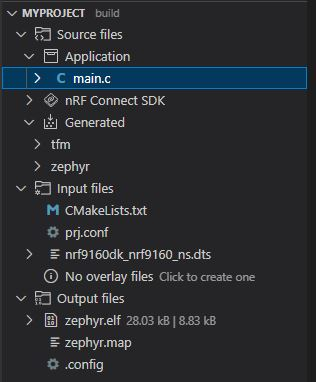
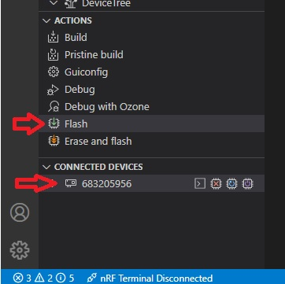
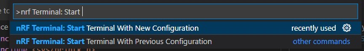
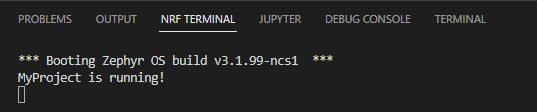

SDK version: NCS v2.1.0; Board: nRF9160DK; Directory with Solution: SOLUTION/MyProject_HandsOn-1

# Creating a Project from Scratch

Creating a project from scratch is quite simple with Zephyr. Here is a description of how to create the simplest version of a project. We use Visual Studio Code in this example.

## Creation of the Project Files

1) First, create a Workspace directory outside the *nRF Connect SDK* folder. This will be the folder where all future projects will be created. For example:   __C:/MyWorkspace__
2) We name our first project "MyProject". So we create a project folder __MyProject__ in our workspace directory:    __C:/MyWorkspace/MyProject__

    NOTE: The folder name must start with a letter and must not contain any spaces!

    

3) Create the following three files in our project directory:

    

    Use a text editor (for example, Windows Notpad) and add the following content to the files:

    _c:/MyWorkspace/MyProject/CMakeLists.txt_
    
       cmake_minimum_required(VERSION 3.13.4)

       # Find external Zephyr project, and load its settings:
       find_package(Zephyr REQUIRED HINTS $ENV{ZEPHYR_BASE})

       # Set project name:
       project (MyApp)

       # add sources
       target_sources(app PRIVATE src/main.c)             

    _c:/MyWorkspace/MyProject/prj.conf_
    
       CONFIG_SERIAL=y   
       
    and create main.c in the subfolder _src_ ->
         _c:/MyWorkspace/MyProject/src/main.c_
    
       #include <zephyr.h>
       #include <sys/printk.h>

       void main(void)
       {
            printk("MyProject is running!\n");
       }

## Open Project in Visual Studio Code

4) Start Visual Studio Code. 
5) Add the new project to Visual Studio Code:

   a) open __nRF Connect__ extension in the primary sidebar
   
   b) click on "Add an existing application". This can be done either in the WELCOME menu or on the "Welcome to nRF Connect" window.

    

6) Select the __MyProject__ folder. (our project folder is the folder where the CMakeLists.txt and prj.conf files are stored.)

7) Before we can work with our project we have to __Add build configuration__. This is done by clicking on the folder icon behind our project in the APPLICATIONS section. 

    

## Project Settings: select Board

8) In the __Board__ drop-down list, enter the board name of your development kit. When you enter the name, you should see that the list is filtered. We use: nrf9160dk_nrf9160_ns 

    

10) For the rest we use the default settings. Click the __Build Configuration__ button. This starts the build process of the project. 

## Project Build and Download to Development Kit

10) After completing the build process, check all available files in the MyProject folder.

    

11) Make sure that the connected kit is found and click __Flash__ in the ACTIONS menu. The code will now be downloaded to the kit. 

    

## Open Terminal and check Output

12) Use the Command Pallete (Ctrl+Shift+P) and enter __nRF Terminal: Start Terminal With New Configuration__. 

    

13) Further settings are needed for the nRF Terminal:

- select interface => "Serial Port"

    

- select COM port

    

- serial port settings => select default setting "115200 8n1"

    

14) Reset the kit by pressing the Reset button on the board. The Zephyr boot message and the string "MyProject is running!" will be displayed in the terminal. 

    

