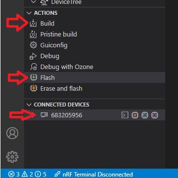
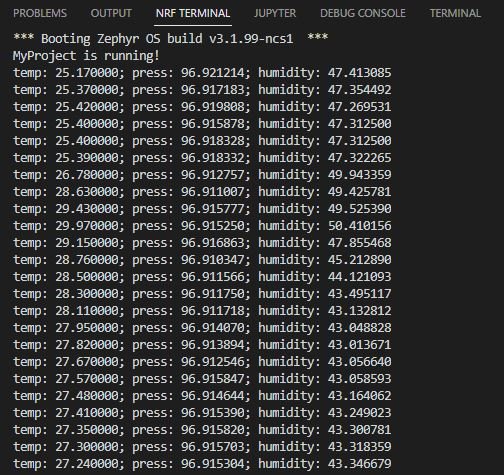

SDK version: NCS v2.1.0; Board: nRF9160DK; Directory with Solution: SOLUTION/MyProject_HandsOn-3

# Enabling the nRF9160 modem and sending UDP data

The main purpose of this session is to apply the learned skills about the nRF Connect SDK and enable the modem part of the nRF9160. We will send live sensor data gather from the previously attached BME280 via LTE to an UDP backend.

## KCONFIG: Adding the nRF9160 Modem and Zephyr's Socket API to our project

1) The required software modules need to be added to our Zephyr based project by setting the appropriate kernel configuration symbols (KCONFIG). Let's think about which software modules are needed:
    > - LTE modem: The modem library, plus functions to control the link layer (Link Control Layer). This enables function calls to configure the modem bands and technologies (LTE-M vs NB-IoT) for example.
    > - Sockets: Zephyr's BSD Socket API will be used to enable socket functions. Sockets are used for transferring data from our app core to the modem core and further to an UDP backend.
    > - Heap and Stacks: We need to adjust the default kernel configuration for our heap and stack sizes.

   So to enable these modules we have to add following lines to the __prj.conf__ file.
    
   _c:/MyWorkspace/MyProject/prj.conf_
    
       # Enable LTE Modem Lib and Link Control
       CONFIG_NRF_MODEM_LIB=y
       CONFIG_LTE_LINK_CONTROL=y
       CONFIG_LTE_AUTO_INIT_AND_CONNECT=n
       CONFIG_LTE_NETWORK_MODE_LTE_M=y
       CONFIG_LTE_NETWORK_MODE_NBIOT=n

       # Enable Zephyr BSD Sockets + use Modem FW IP Stack
       CONFIG_NETWORKING=y
       CONFIG_NET_NATIVE=n
       CONFIG_NET_SOCKETS=y
       CONFIG_NET_SOCKETS_OFFLOAD=y

       # Heap and stack size adjustment
       CONFIG_HEAP_MEM_POOL_SIZE=1024
       CONFIG_MAIN_STACK_SIZE=4096
    
## main.c: Including the header files and static variables into our application code
We have included the libraries and set up the kernel configuration items in the previous step. We will now continue working on our main.c file to make use of the modem and include C dependencies.

2) Start by including the appropriate C header files:

    _c:/MyWorkspace/MyProject/src/main.c_ - add following lines to the top of the file that has the includes:
        
       /* Code addons for UDP data sample */
       #include <stdio.h>                  // sprintf - standard C IO calls
       /* LTE Modem Header Files */
       #include <modem/lte_lc.h>           // Link Control Functionality
       #include <zephyr/net/socket.h>      // Zephyr Socket Functionality

3) Continue by adding some definitions that determine our UDP backend, and identify our data. Use the define MY_NAME to enter your name/some unique ID to distinguish your data at the backend from your colleague's data.

    _c:/MyWorkspace/MyProject/src/main.c_ - add following lines below the includes, but change MY_NAME:
        
       /* UDP Sample Defines */
       #define MY_NAME "Nordic"
       #define UDP_SERVER_ADDRESS "173.249.8.201"
       #define UDP_SERVER_PORT 25000
       #define UDP_TRANSMISSION_INTERVAL 30

    Hint: The definitions determine the UDP server, a different server address could be selected here. The transmission interval sets the sleep time between two uplinks.

4) Add static and global variables that are required for our application. They include a handle to our UDP socket, a variable storing our UDP server address information, and data buffer that is holding the data for transmission.

    _c:/MyWorkspace/MyProject/src/main.c_ - add following lines below the UDP Sample Defines:

       /* Static, global definitions */
       static int socket_client;
       static struct sockaddr_storage host_addr;
       static char data_buffer[64];

## main.c: Adding functions for the modem control

5) We will now add the function that accesses the LTE link control layer and initializes the modem.

    _c:/MyWorkspace/MyProject/src/main.c_ - add following lines below the static global definitions:

       /* Modem init and connect function */
       #if defined(CONFIG_NRF_MODEM_LIB)
       static int modem_init_and_connect(void)
       {
            int err;
            printk("Initializing modem and connecting to LTE network...\n");

            if (IS_ENABLED(CONFIG_LTE_AUTO_INIT_AND_CONNECT)) {
                /* Do nothing, modem is already configured and LTE connected. */
            } else {
                err = lte_lc_init_and_connect();
                if (err) {
                    printk("Init/Connect to LTE network failed, error: %d\n", err);
                    return err;
                }
            }
            printk("LTE connection successful.\n");
            return 0;
       }
       #endif

## main.c: Adding functions to control the UDP socket
6) We will now add the functions that setup/init the UDP socket, lets the socket connect, and potentially disconnect/close.

    _c:/MyWorkspace/MyProject/src/main.c_ - add following lines below the Modem init and connect function:

       /* Init UDP Socket */
       static int socket_init(void)
       {
            struct sockaddr_in *server4 = ((struct sockaddr_in *)&host_addr);

            server4->sin_family = AF_INET;
            server4->sin_port = htons(UDP_SERVER_PORT);

            inet_pton(AF_INET, UDP_SERVER_ADDRESS, &server4->sin_addr);

            return 0;
       }

       /* Close UDP Socket */
       static void socket_close(void)
       {
            (void)close(socket_client);
       }
       
       /* Connect UDP Socket */
       static int socket_connect(void)
       {
            int err;

            socket_client = socket(AF_INET, SOCK_DGRAM, IPPROTO_UDP);
            if (socket_client < 0) {
                printk("Failed to create UDP socket: %d\n", errno);
                err = -errno;
                goto error;
            }

            err = connect(socket_client, (struct sockaddr *)&host_addr, sizeof(struct sockaddr_in));
            if (err < 0) {
                printk("Connect failed : %d\n", errno);
                goto error;
            }

            return 0;

       error:
            socket_close();

            return err;
       }  

## Understanding the use of previously added functions

7) We are using the functions __modem_init_and_connect__ to initialize the nRF9160 modem based on default/selected kCONFIG parameters and connect to the cellular network. The function is blocking and thus the application will hold until a suitable network is found. 

An important link control kconfig item is the selection of the technology (e.g. LTE-M). This was set in our _proj.conf_ with __CONFIG_LTE_NETWORK_MODE_LTE_M=y__. Other parameters could be set via further kConfig items to further deviate the configuration from the Nordic default settings.

The functions around the UDP socket (socket_init, socket_close, socket_connect) are meant to be run after the modem has been initialized and once it is connected to the cellular network. The socket close function is not used today, but could be well implemented in an actual application. All functions are now defined but will be called from the main routine which is touched in the following steps.

## main.c: Putting the puzzle together and calling our routines from the main(void) routine

8) main routine before while(1) loop:

    _c:/MyWorkspace/MyProject/src/main.c_ - add following lines inside __void main(void)__ routine but before while(1) loop:
    
       int err;
       // Modem init and connect
       err = modem_init_and_connect();
       if (err){
            return;
       }

       // Socket init and connect / open
       socket_init();
       socket_connect();

9) Main routine inside while(1) loop. This an important section, we will continue to use our sensor readings, but format the temperature sensor data, pack it into our transmit buffer and send it over to UDP socket.

    _c:/MyWorkspace/MyProject/src/main.c_ - add following lines inside __void main(void)__ routine and within while(1) loop - but after sensor data fetch:

       // Format sensor data, copy into transmit buffer
       temp.val2 = temp.val2/10000; //shrink fractional part to 2 digits
       sprintf(data_buffer, "[%s -- Temp: %d.%02d C]", MY_NAME, temp.val1, temp.val2);

       /* Transmit via UDP data socket */
       err = send(socket_client, data_buffer, strlen(data_buffer), 0);
       if (err < 0) {
            printk("Failed to transmit UDP packet, %d\n", errno);
       }else{
            printk("UDP data sent, content: %s\n", data_buffer);
       }

10) Adjust sleep time between main loop executions. We will keep the sample simple and use kernel sleep times to add a delay between sensor data transmissions.

    _c:/MyWorkspace/MyProject/src/main.c_ - change the k_sleep line to:

        k_sleep(K_SECONDS(UDP_TRANSMISSION_INTERVAL));

## Build the project and Download to Development Kit

11) Click the "Build" button in the ACTIONS menu. 

12) Make sure that the connected kit is found and click __Flash__ in the ACTIONS menu. The code will now be downloaded to the kit. 

## Open Terminal and check Output

13) Open the terminal (for example, __nRF Terminal__).

> Note: nRF Terminal might still be open in case you used it in previous hands-on.  
    
14) Reset the kit by pressing the Reset button on the board. The Zephyr boot message and the string "MyProject is running!" will be displayed in the terminal, followed by following readings: 

    

