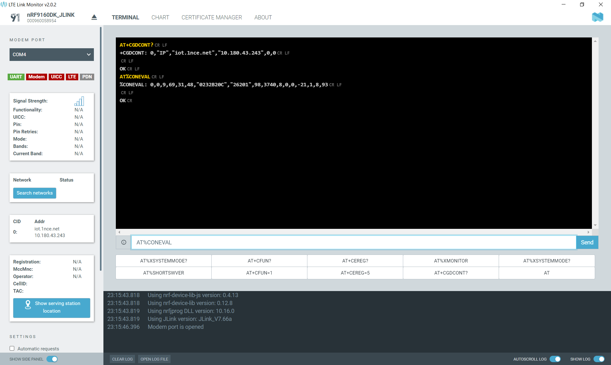

SDK version: NCS v2.1.0; Board: nRF9160DK; Directory with Solution: SOLUTION/MyProject_HandsOn-3

# Using the Serial LTE Modem (SLM) application to test the connectivity through AT cmds

In this course we will use the example application __Serial LTE Modem__ (SLM) that is part of nRF Connect SDK. SLM can be used to test the nRF9160 modem, check on the RF signal and coverage or perform simple data transmissions. The software runs on the application core of the nRF9160 but enables an AT command pass through mode. This gives the user a comprehensive AT command interface through UART. In the case of the nRF9160 DK the UART interface is routed to a Virtual COM port (USB port on the nRF9160 DK). The default settings for the serial communication are: 115200 baud and 8N1 framing. AT commands need to be terminated with CR+LF (carriage return + line feed character). Feel free to use your terminal program of choice (e.g. TeraTerm, hterm or Nordic's LTE Link Monitor). Hint: The serial communication settings on the nRF9160 can be changed when touching the source code of the SLM application. We will however stay with the default settings.

Also, it is important to understand the benefits of the SLM application. SLM gives you acccess to all AT commands of the nRF9160 Modem FW (commands like: AT+COPS, AT+CEREG, AT%XSYSTEMMODE and so on...), but also includes additional commands that are implemented inside the SLM application (thus not part of the modem FW) and only specific to SLM!

In other words, customers can see with the SLM example on how to create their own AT commands inside their application code.

SLM specific commands are identified with a Hash (_AT#_ ), examples are commands that use the IP stack, e.g. perform a server ping, send TCP/UDP data or even use MQTT.

## Adding the SLM application to our VS Code workspace

1) Inside VS Code open the nRF Connect for VS Code extension menu and click on _Create a new application_.

2) Select _Freestanding_ application type and ensure you are working with the correct nRF Connect SDK version (in this case v2.1.0).

3) Browse the application templates and search for _Serial LTE Modem_.

4) Select the Serial LTE Modem application and click on _Create Application_.

## Adding the build configuration

As SLM is a pre-developed application we will not touch the source code. As with our previous project though, we will need to add a build configuration in order to build the source code. The build configuration links the build to a specific target hardware (in our case the nRF9160DK).

5) Create a new build configuration as marked with STEP 1 in the image below.

6) Select _nRF9160dk_nrf9160_ns_ as target hardware / board (STEP 2 in below image).

7) Keep all setings to default and click on _Build Configuration_ (STEP 3 in below image).

## Building the SLM application from source and flashing it to our DK

8) Upon adding the build configuration, a pristine build will start automatically. As the application is fairly complex and heavy, the source code compilation from scratch will take a few minutes. If you like to re-run the build process, click on the _build_ action.

9) Ensure that the nRF9160 DK kit is connected and click on __Flash__ in the ACTIONS menu. The code will now be downloaded to the kit.

## Using the SLM application through a serial terminal

10) Start your serial terminal program of choice (e.g. Nordic's LTE Link Monitor). Hint: When using Nordic's LTE Link Monitor, I recommend to turn off the feature "Automatic requests" in order to keep full control of which AT commands are sent to the nRF9160.

11) Select the nRF9160DK under _Select Devices_ in the top left corner, the terminal will open the appropriate VCOM port and connect.

12) Verify interface functionality by sending a simple __AT__. As response you should see __OK__ indicating correct settings and a running modem firmware plus application software on the nRF9160.

## Configuring the modem through AT commands

The nRF9160 will respond with an OK to a successful AT command. You should expect an OK to every AT command in order to continue.

13) Ensure the modem is switched off or in airplane mode (CFUN: 0 or CFUN: 4).

        AT+CFUN?

14) Setup the modem to allow LTE-M and NB-IoT cell search (AT command is only possible when modem is off)

        AT%XSYSTEMMODE=1,1,0,0

15) Enable LTE registration notifications (modem will automatically trigger messages upon network registration, cell change or similar).

        AT+CEREG=5

16) (Optional) Verify the modem firmware version (in this case we expect Modem FW v1.3.2).

        AT%SHORTSWVER

17) Enable the modem, and start the LTE cell search

        AT+CFUN=1

18) A CEREG status response of 1 or 5 indicates that you are registerd and connected to the cellular network (1: home network, 5: roaming).

## Enhanced AT command usage

19) You can also verify that you are connected to the cellular network by checking whether you have obtained an IP address.

        AT+CGDCONT?

20) A powerful command to verify RF stats is the Nordic proprietary connection evaluation command. We can check which operator (MCC+MNC) we are connected to, and on which LTE band with which reference signal power from the base station (RSRP).

        AT%CONEVAL

My connection evaluation shows that I am connected to 26201 which is Germany (262) and Telekom cellular network (01). Physical cell ID (PCI) is 98, we are on absolute RF channel number (EARFCN) 3740, LTE band 8. The stated value for the RSRP is 69, which converts to -71 dBm (using the formula in the datasheet). See the AT command reference manual for further details on the response parameters of the connection evaluation.

## Using SLM specific commands

Let us run some SLM specific commands to test the data connection.

21) Ping a server, e.g. Google DNS - run 5 iterations each with 5s timeout, compute the average:

        AT#XPING="8.8.8.8",45,5000,5,1000

22) Send UDP data, e.g. to our test server. 

       First, open the UDP socket.

        AT#XSOCKET=1,2,0

       Then, send UDP data. Note, our test server requires a bracket character (__[__) to parse and display the data on the debug screen webpage.

        AT#XSENDTO="173.249.8.201",25000,"[ This is my test data"

       Finally, and when done, close the UDP socket.
       
        AT#XSOCKET=0

